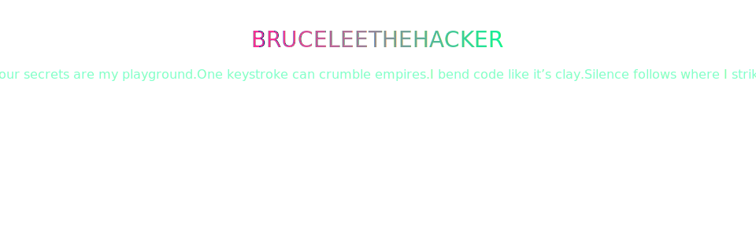

<div align="center">

<!-- ANIMATED BANNER -->


<!-- TYPING ANIMATION -->


<br/>

<!-- LIVE VISITOR & FOLLOWER COUNTERS -->
<a href="https://github.com/bruceleethehacker">
  
</a>
&nbsp;
<a href="https://github.com/bruceleethehacker?tab=followers">
  
</a>
&nbsp;


</div>

---

<!-- HACKER TERMINAL -->
<div align="center">


</div>

<div align="center">

```
╔══════════════════════════════════════════════════════════╗
║  💻  C Y B E R   T E R M I N A L   v2.0                 ║
╠══════════════════════════════════════════════════════════╣
║                                                          ║
║  root@brucelee:~$ whoami                                 ║
║                                                          ║
║  ┌─────────────────────────────────────────────────┐    ║
║  │  Name      :  Bruce Lee The Hacker              │    ║
║  │  Role      :  Ethical Hacker                    │    ║
║  │  Focus     :  Cybersecurity & AI                │    ║
║  │  Specialty :  Intrusion Detection Systems       │    ║
║  │  OS        :  Kali Linux                        │    ║
║  │  Location  :  India  🌐                         │    ║
║  │  Status    :  🟢  Securing the Digital World    │    ║
║  └─────────────────────────────────────────────────┘    ║
║                                                          ║
║  root@brucelee:~$ sudo access --level=root               ║
║  ✓  Access Granted  —  Clearance Level: ROOT             ║
║                                                          ║
║  root@brucelee:~$ _                                      ║
╚══════════════════════════════════════════════════════════╝
```

</div>

---

## 🧠 About Me

```python
class BruceLeeTheHacker:
    name       = "Bruce Lee (Veda Nishanth)"
    alias      = "bruceleethehacker"
    role       = ["Ethical Hacker", "AI Security Researcher", "Developer"]
    focus      = ["Network Intrusion Detection", "Behavioral Auth", "AI Security"]
    currently  = "Building PRECRIME — AI-powered predictive cybersecurity"
    learning   = ["Advanced Malware Analysis", "LLM Security", "Red Teaming"]
    ask_me     = ["Python", "IDS/IPS", "ML for Security", "Network Analysis"]

    def mission(self):
        return "Predict. Prevent. Protect."
```

- 🛡 Passionate about **Cybersecurity** and **Ethical Hacking**
- 🤖 Building **AI-powered Security Systems** that detect threats in real time
- 🌐 Focused on **Network Security**, Threat Detection & Packet Analysis
- 🚀 Creating real-world cybersecurity solutions — not just theory
- 🔥 Constantly learning, experimenting, and pushing boundaries

---

## ⚔️ Cybersecurity Arsenal

<div align="center">

### 💻 Languages


### 🔐 Security & Pentesting Tools


### 🤖 AI & Machine Learning


### ☁️ Databases & Infrastructure


</div>

---

## 📊 GitHub Stats

<div align="center">


&nbsp;


</div>

<div align="center">


</div>

<div align="center">


</div>

---

## 🗺️ Profile Summary

<div align="center">


&nbsp;

&nbsp;

&nbsp;


</div>

---

## 🐍 Contribution Snake

<div align="center">


<picture>
  <source media="(prefers-color-scheme: dark)" srcset="https://raw.githubusercontent.com/bruceleethehacker/bruceleethehacker/output/github-snake-dark.svg" />
  <source media="(prefers-color-scheme: light)" srcset="https://raw.githubusercontent.com/bruceleethehacker/bruceleethehacker/output/github-snake.svg" />
  
</picture>

</div>

<details>

```yaml
# .github/workflows/snake.yml
name: Generate Snake Animation
on:
  schedule: [{ cron: "0 0 * * *" }]
  workflow_dispatch:
jobs:
  snake:
    runs-on: ubuntu-latest
    steps:
      - uses: Platane/snk@v3
        with:
          github_user_token: ${{ secrets.GITHUB_TOKEN }}
          outputs: |
            dist/github-snake.svg
            dist/github-snake-dark.svg?palette=github-dark
      - uses: crazy-max/ghaction-github-pages@v3
        with:
          target_branch: output
          build_dir: dist
        env:
          GITHUB_TOKEN: ${{ secrets.GITHUB_TOKEN }}
```

</details>

---

## 🔥 Featured Projects

<div align="center">

[](https://github.com/bruceleethehacker/BLCD-RealTime-IDS)
&nbsp;
[](https://github.com/bruceleethehacker/dba)

[](https://github.com/bruceleethehacker/PRECRIME)

</div>

---

### 🔒 Bruce Lee Cyber Defense — AI-Powered Network Intrusion Detection System

> Real-time network monitoring and threat classification powered by Machine Learning.

| Feature | Status |
|:--|:--:|
| Real-time Packet Analysis | ✅ |
| Threat Detection Engine | ✅ |
| Attack Classification (ML) | ✅ |
| Machine Learning Integration | ✅ |
| Live Monitoring Dashboard | ✅ |

---

### 🧬 Digital Behavioral Authentication — Continuous User Authentication System

> Goes beyond passwords — authenticates users continuously through behavioral patterns.

| Feature | Status |
|:--|:--:|
| Keystroke Dynamics Analysis | ✅ |
| Mouse Movement Tracking | ✅ |
| Session Monitoring | ✅ |
| Behavioral Profiling | ✅ |
| Anomaly Detection | ✅ |

---

### 🔮 PRECRIME: AI-Based Predictive and Preventive Cybersecurity System

> **Abstract (IEEE Style):** PRECRIME is an intelligent, AI-driven cybersecurity framework designed for predictive threat analytics and proactive intrusion prevention in modern networked environments. The system leverages machine learning and behavioral intelligence to transition cybersecurity from a reactive defense model to a **predictive and preventive security paradigm**.

```
╔══════════════════════════════════════════════════════════════╗
║  🧠  SYSTEM OBJECTIVE                                        ║
╠══════════════════════════════════════════════════════════════╣
║                                                              ║
║  To minimize attack surface exposure by identifying          ║
║  malicious intent PRIOR to full exploitation — enabling      ║
║  preemptive mitigation actions and strengthening overall      ║
║  cyber defense resilience.                                   ║
║                                                              ║
╚══════════════════════════════════════════════════════════════╝
```

| Core Functional Feature | Status |
|:--|:--:|
| AI-based cyber threat prediction (supervised + unsupervised ML) | ✅ |
| Real-time network traffic analysis for early-stage attack detection | ✅ |
| Behavioral anomaly detection via continuous system activity profiling | ✅ |
| Dynamic risk scoring of incoming and ongoing sessions | ✅ |
| Zero-day attack pattern approximation via historical threat correlation | ✅ |
| Adaptive intrusion prevention with automated response triggering | ✅ |
| Continuous learning framework for evolving threat intelligence | ✅ |
| Multi-layer security decision engine (benign vs malicious classification) | ✅ |

**🛡 Use Cases:**
- Insider threat detection
- Account takeover prevention
- Real-time intrusion mitigation
- High-security system monitoring
- Financial & enterprise security systems

---

## 🏆 Trophies

<div align="center">


</div>

---
🖤 BruceLeeTheHacker

<p align="center">

</p>

---

## 🌐 Connect With Me

<div align="center">

[](https://github.com/bruceleethehacker)
[](https://www.linkedin.com/in/veda-nishanth-50a006395)
[](mailto:obitouchiha00143@gmail.com.com)
[](https://bruceleethehacker.dev)

</div>

---

<div align="center">

```
╔══════════════════════════════════════════════════════╗
║                                                      ║
║   root@brucelee:~$ cat /etc/motd                     ║
║                                                      ║
║   "The quieter you become,                           ║
║    the more you are able to hear."                   ║
║                                  — Bruce Lee         ║
║                                                      ║
║   root@brucelee:~$ Predict. Prevent. Protect. 🛡     ║
║                                                      ║
╚══════════════════════════════════════════════════════╝
```


</div>