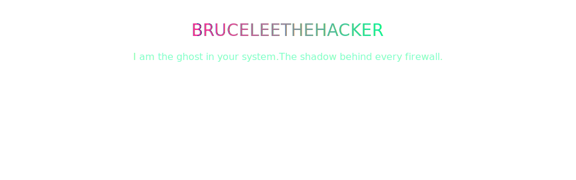

# 🖤 BruceLeeTheHacker

  

---

## ⚡ About Me
I am a professional, ethical hacker with a dark neon edge. I test systems, break code in safe labs, and teach others to defend themselves.  

- 🧠 **Expertise:** Penetration testing, threat hunting, cyber intelligence, lab simulations  
- 🛠️ **Tools & Skills:** Linux, Python, Bash, Go, Docker, Git, GitHub, AWS, VSCode  

---

## 🔥 Featured Projects
| Project | Description | Link |
|--------|-------------|------|
| **VulnHunter** | Safe, automated recon + triage tool | [GitHub](https://github.com/bruceleethehacker/vulnhunter) |
| **PhishLab** | Awareness & phishing simulation framework | [GitHub](https://github.com/bruceleethehacker/phishlab) |
| **RedOps** | Offensive automation scripts for isolated labs | [GitHub](https://github.com/bruceleethehacker/redops-scripts) |

---

## 📊 GitHub Stats

  
  

  

---

## 📬 Connect

  
  
  
  

---

## ⚠️ Responsible Disclosure
All tools and research are for **ethical, lab-safe use only**. Do not run them on third-party systems.  
If you find a vulnerability, report it responsibly: responsible-disclosure@bruceleethehacker.dev
